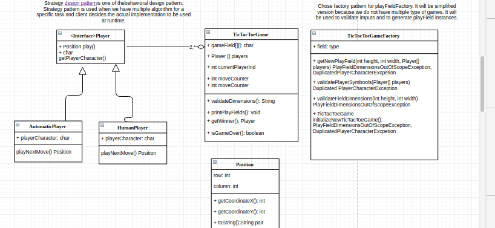

# TICTACTOE2
Application is designed as library which can be included in bigger application which will cover gui implementation and additional logic.

This is simple tic tac toe game with some extended features.
Some requirements were: 
- To enable playing on bigger field max 10X10
- To enable game for three configurable users
- To enable add configurable Automatic player
- Who start first should be dynamically decided

It was not specified which type of gui should be used and printout is simple in console.

As mentioned requirement was to use good Object Oriented design, and logic for Automatic player (Artificial Inteligence is not primary goal).
Artificial Intelligence part is considered to be improved in future. 

<b>NOTE!!! For other similar tasks I was considering MinMax algorithm, but it is applicable for games with 2 players.</b>
In this case we have 3 or more players and solution could be explained as couple of steps: 
- Play winning move if exists
- Play defense if necessary
- Play around your values or some random value.
   
As Build tool application is using Maven.

## Design decisions
Code is organised as Java library which could be integrated into bigger application with GUI implementation and additional functionalities. 

<b>Strategy design pattern</b> is chosen because different types of players (Regular and Automatic). Because of that we specify interface for Player and implement it in two different implementations of player. We forward to player board state, and leave to player implementation to decide/inser values.

<b>Factory Pattern</b> Is used as simple way to generate configured instance of game.

Inline-style: 

## Prerequisites

Example of configuration file which is used by PropertiesLoader class is:
- TicTacToe2/src/main/resources/configuration.properties

NOTE!!! It is up to your implementation from where you will load configuration.

## Getting Started

To start applicaiton just execute mvn clean install and run tic.tac.toe.Main.java file.

## Integration and ussage as library

To integrate it as library you need to add dependent library to the class path(maven gradle or some other tool).
Example of usage of integrated application could be founded in Main class. 
Simplified steps to integrate are:
- Load Configuration Propery with PropertyLoader
- Get game from game factory gameFactory.createTicTacToe
- start game playTheGame()

<b>Note that in case of integration to some gui app Human Player interaction should be changed and improved. Currently we are using scanner input</b>

## some ideas
To expose interface to play moves from outside game because currently game is controlling moves.
- Game should have identifier in this case to access  to game.
- Players should have indentifier to verify that it is particular user.
 

